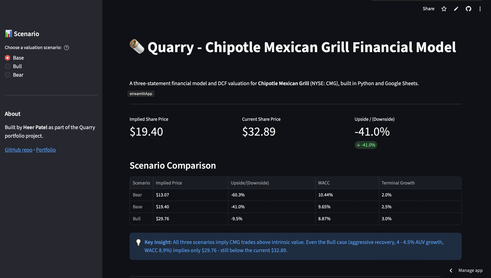
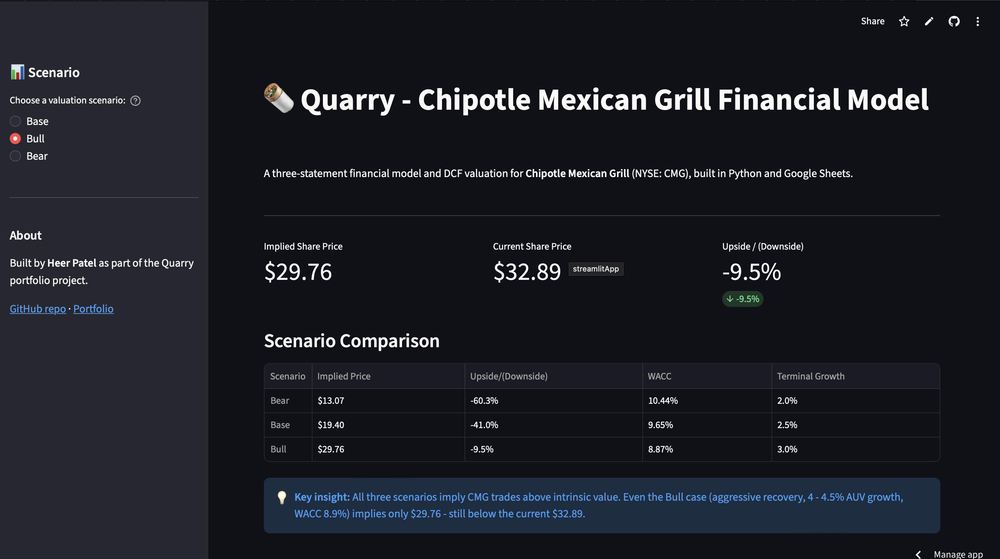
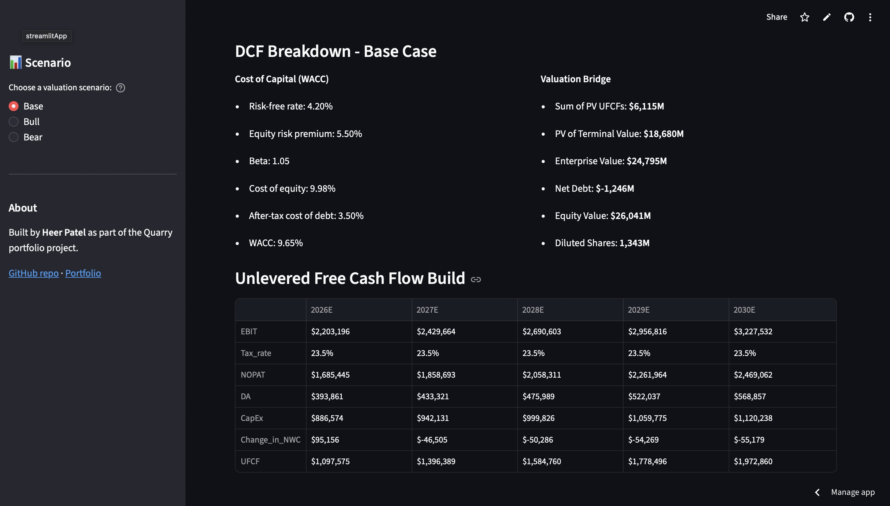
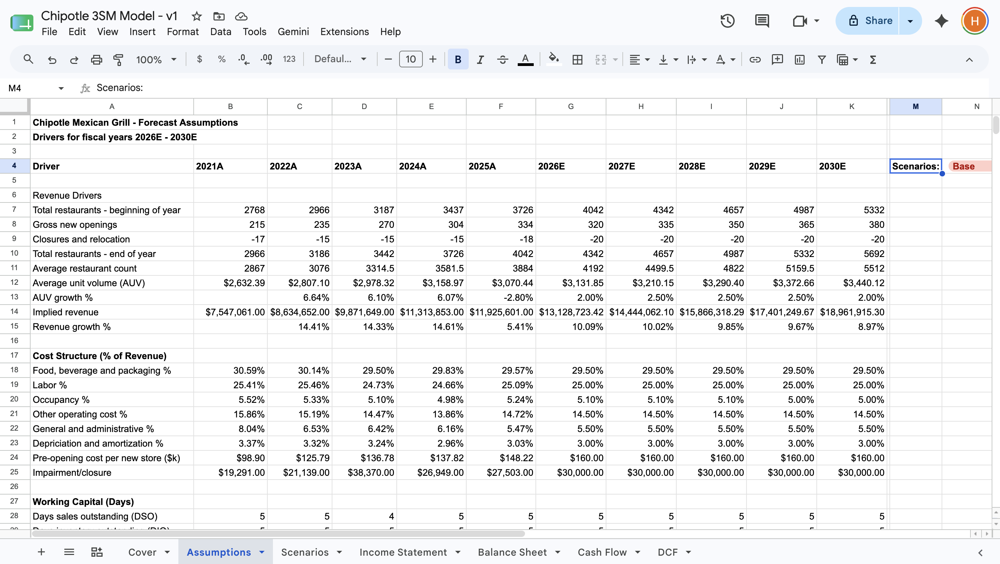
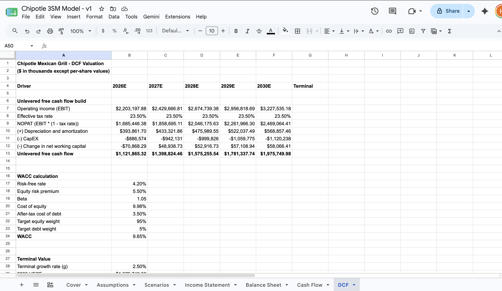
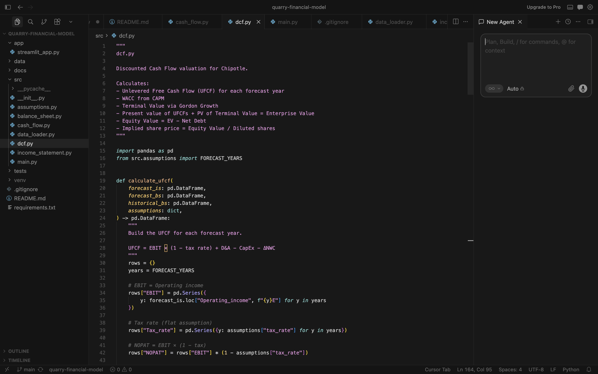

# Quarry — Chipotle Mexican Grill Financial Model

🌐 **[Live Demo →](https://quarry-cmg-model.streamlit.app)** · 📂 [GitHub Repo](https://github.com/Heer1910/quarry-financial-model)

A complete three-statement financial model and DCF valuation for Chipotle Mexican Grill (NYSE: CMG), built in both Google Sheets and Python.

**Implied share price:** $19.40 (Base case) vs. current $32.89 → **41% downside**



---

## Key findings

| Scenario | Implied Price | Upside/(Downside) | Story |
|---|---|---|---|
| Bear | $13.07 | -60.3% | Structural decline thesis |
| Base | $19.40 | -41.0% | Steady-state, no recovery |
| Bull | $29.76 | -9.5% | Aggressive recovery still below market |

**Conclusion:** The Base case suggests CMG trades above intrinsic value under normalized growth and margin assumptions. Even the Bull case remains below the current market price, implying the market may be pricing in execution beyond the model's aggressive recovery case.



*Scenarios update in real-time via the sidebar toggle.*

---

## What this project demonstrates

- **Financial modeling fundamentals:** historical balance sheet reconciliation across 5 years (treasury stock retirement, 50-for-1 stock split, materiality adjustments), three-statement linking, DCF valuation with WACC and terminal value, scenario analysis
- **Python proficiency:** translating Excel logic to pandas DataFrames, modular code architecture, proper IS→BS→CF circular linking
- **Data pipelines:** loading historical 10-K data from CSV files, cleaning currency strings, structured data validation
- **Deployment:** interactive Streamlit dashboard hosted on Streamlit Community Cloud

---

## Project structure

```
quarry-financial-model/
├── app/
│   └── streamlit_app.py        # Interactive dashboard
├── data/                       # Historical 10-K data (2021A-2025A) as CSV
│   ├── historical_is.csv
│   ├── historical_bs.csv
│   └── historical_cf.csv
├── docs/
│   └── screenshots/            # Project visuals
├── model/
│   └── Chipotle_3SM_Model.xlsx # Excel/Sheets source model
├── src/                        # Model logic
│   ├── assumptions.py          # Bull/Base/Bear scenarios + market inputs
│   ├── data_loader.py          # CSV → pandas DataFrames
│   ├── income_statement.py     # IS forecast (2026E-2030E)
│   ├── balance_sheet.py        # BS forecast with cash plug
│   ├── cash_flow.py            # CF forecast + circular link to BS
│   ├── dcf.py                  # DCF valuation with scenarios
│   └── main.py                 # Orchestrator
├── tests/
│   └── test_model.py           # 6 sanity checks (balance, scenarios, UFCF, etc.)
├── requirements.txt
└── README.md
```

---

## How to run

```bash
# Clone the repo
git clone https://github.com/Heer1910/quarry-financial-model.git
cd quarry-financial-model

# Set up environment
python3 -m venv venv
source venv/bin/activate  # On Windows: venv\Scripts\activate
pip install -r requirements.txt

# Run the full model (CLI output)
python3 -m src.main

# OR launch the interactive Streamlit dashboard
streamlit run app/streamlit_app.py
```

---

## Tests

The model includes a `pytest` suite that validates correctness:

```bash
pytest tests/ -v
```

Six tests verify:
- Balance sheet balances across all forecast years and scenarios
- Scenario ordering: Bear price < Base price < Bull price
- Net debt is negative (CMG holds net cash, no traditional debt)
- UFCF is positive in every forecast year, every scenario
- Cash balance never goes negative under any scenario
- Base case implied price matches the reference Sheets model within $1

---

## Methodology

**Historical period (2021A-2025A):** Sourced from Chipotle 10-K filings on SEC EDGAR. Balance sheet reconciles to zero across all five years after adjusting for the 50-for-1 stock split (mid-2024) and treasury stock retirement ($5.2B).

**Forecast period (2026E-2030E):** Five-year forward forecast driven by:
- Store count (openings, closures) and AUV growth
- Cost ratios as % of revenue (food/bev, labor, occupancy, G&A, D&A)
- Working capital days (DSO, DIO, DPO)
- CapEx per new store + maintenance % of revenue

**DCF:** Unlevered free cash flow with mid-year convention, terminal value via Gordon Growth, WACC from CAPM (Rf 4.20%, ERP 5.50%, Beta 1.05 Base).

**Scenarios:** Single-dropdown toggle in Sheets, `get_assumptions(scenario)` function in Python. Bear/Base/Bull differ on store openings, AUV growth, cost ratios, beta, and terminal growth.

### DCF build



---

## Excel vs. Python

📥 **[Download the Excel model →](model/Chipotle_3SM_Model.xlsx)** — Full 3-statement model with dynamic scenario toggle.

The same model exists in two forms. Output matches within $0.04 per share across all scenarios.

### Google Sheets — Assumptions tab



### Google Sheets — DCF tab



### Python — modular implementation



This dual implementation demonstrates the ability to translate financial logic between tools — a key skill in real FP&A and equity research workflows.

---

## Data sources

All inputs are verifiable. See [`docs/sources.md`](docs/sources.md) for direct links to each filing and market data point.

- **Historicals:** Chipotle 10-K filings (2021–2025), SEC EDGAR
- **Current share price:** $32.89 (May 2026)
- **Sell-side targets:** Guggenheim $35 (bearish), Consensus ~$46, Citi $46 (bullish)

---

## Author

**Heer Patel** — Data Science + Finance, University of Illinois Chicago (May 2026)
[Portfolio](https://heer1910.github.io) · [LinkedIn](https://www.linkedin.com/in/heer1910)